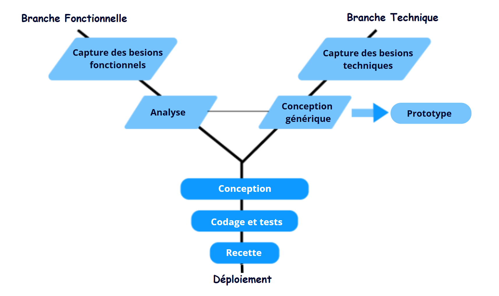

## Projet E-Commerce 

**Présenté par** : Zakaria Azizi

**Encadré par** : ESSARRAJ Fouad

|||
### 1. Introduction : 

|||
### 2. Methode de travail :
- 2.1. Scrum
- 2.2. 2TUP

---
> #### 2.1. Scrum :

---
> #### 2.2. 2TUP :

|||
### 3. Planification :

> #### Semaine 1
<table style="font-size: 28px; border-collapse: collapse; width: 100%;">
  <thead>
    <tr>
      <th style="border: 1px solid grey; padding: 8px;"></th>
      <th style="border: 1px solid grey; padding: 8px;">1</th>
      <th style="border: 1px solid grey; padding: 8px;">2</th>
      <th style="border: 1px solid grey; padding: 8px;">3</th>
    </tr>
  </thead>
  <tbody>
    <tr>
      <td style="border: 1px solid grey; padding: 8px;">Lundi</td>
      <td style="border: 1px solid grey; padding: 8px;">Planification</td>
      <td style="border: 1px solid grey; padding: 8px;">Auto-formation</td>
      <td style="border: 1px solid grey; padding: 8px;">Auto-formation</td>
    </tr>
    <tr>
      <td style="border: 1px solid grey; padding: 8px;">Mardi</td>
      <td style="border: 1px solid grey; padding: 8px;">-</td>
      <td style="border: 1px solid grey; padding: 8px;">-</td>
      <td style="border: 1px solid grey; padding: 8px;">Atelier</td>
    </tr>
    <tr>
      <td style="border: 1px solid grey; padding: 8px;">Mercredi</td>
      <td style="border: 1px solid grey; padding: 8px;">Atelier</td>
      <td style="border: 1px solid grey; padding: 8px;">Atelier</td>
      <td style="border: 1px solid grey; padding: 8px;">Atelier</td>
    </tr>
    <tr>
      <td style="border: 1px solid grey; padding: 8px;">Jeudi</td>
      <td style="border: 1px solid grey; padding: 8px;">Projet fil rouge</td>
      <td style="border: 1px solid grey; padding: 8px;">Prototype</td>
      <td style="border: 1px solid grey; padding: 8px;">Prototype</td>
    </tr>
    <tr>
      <td style="border: 1px solid grey; padding: 8px;">Vendredi</td>
      <td style="border: 1px solid grey; padding: 8px;">Prototype</td>
      <td style="border: 1px solid grey; padding: 8px;">Base de données</td>
      <td style="border: 1px solid grey; padding: 8px;">-</td>
    </tr>
  </tbody>
</table>

|||
> #### Semaine 2 
<table style="font-size: 28px; border-collapse: collapse; width: 100%;">
  <thead>
    <tr>
      <th style="border: 1px solid grey; padding: 8px;"></th>
      <th style="border: 1px solid grey; padding: 8px;">1</th>
      <th style="border: 1px solid grey; padding: 8px;">2</th>
      <th style="border: 1px solid grey; padding: 8px;">3</th>
    </tr>
  </thead>
  <tbody>
    <tr>
      <td style="border: 1px solid grey; padding: 8px;">Lundi</td>
      <td style="border: 1px solid grey; padding: 8px;">Maquettes</td>
      <td style="border: 1px solid grey; padding: 8px;">Maquettes</td>
      <td style="border: 1px solid grey; padding: 8px;">Maquettes</td>
    </tr>
    <tr>
      <td style="border: 1px solid grey; padding: 8px;">Mardi</td>
      <td style="border: 1px solid grey; padding: 8px;">-</td>
      <td style="border: 1px solid grey; padding: 8px;">-</td>
      <td style="border: 1px solid grey; padding: 8px;">Réalisation</td>
    </tr>
    <tr>
      <td style="border: 1px solid grey; padding: 8px;">Mercredi</td>
      <td style="border: 1px solid grey; padding: 8px;">Réalisation</td>
      <td style="border: 1px solid grey; padding: 8px;">Réalisation</td>
      <td style="border: 1px solid grey; padding: 8px;">Réalisation</td>
    </tr>
    <tr>
      <td style="border: 1px solid grey; padding: 8px;">Jeudi</td>
      <td style="border: 1px solid grey; padding: 8px;">Réalisation</td>
      <td style="border: 1px solid grey; padding: 8px;">Réalisation</td>
      <td style="border: 1px solid grey; padding: 8px;">Réalisation</td>
    </tr>
    <tr>
      <td style="border: 1px solid grey; padding: 8px;">Vendredi</td>
      <td style="border: 1px solid grey; padding: 8px;">Réalisation</td>
      <td style="border: 1px solid grey; padding: 8px;">Réalisation</td>
      <td style="border: 1px solid grey; padding: 8px;">-</td>
    </tr>
  </tbody>
</table>

|||
> #### Diagramme de Gantt : 

|||
### 4. Analyse :

|||
### 5. Design :

|||
### 6. Apprentissage :

- Blade
- Controller
- Model
- Repository
- Ajax

|||
### 7. Prototype :

- Voir le produit
- Ajouter un produit
- Supprimer un produit
- Ajax (page unique)
- Repository

|||
### 8. Réalisation :

|||
### 9. Conclusion :

